# Setup a chatbot locally using Python Streamlit and Ollama
Setup a quick chatbot locally with ollama and streamlit. This is made from a Windows machine, so you might need to modify a few steps if you are on a Linux or Mac machine ma dudes.

## Download and install Ollama on your computer
[Ollama](https://ollama.com/)  
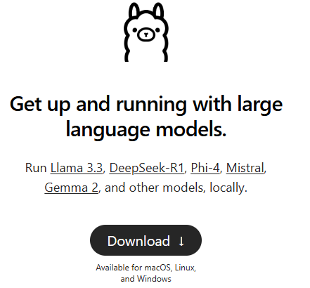

## Download the models you want
x) Open powershell or cmd  
x) Download models you want to your local device via the [models browser](https://ollama.com/search)  
I recommend download a small model first to get things setup properly and then you can try bigger models. You can find the size here by opening a specific model on the webpage:  
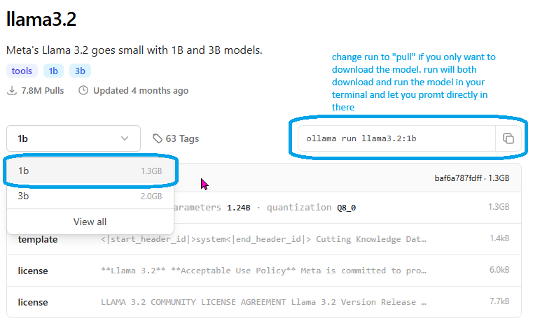

x) Etc. 
 ```bash
ollama pull qwen2.5-coder:3b
 ```
   or
```bash
ollama pull deepseek-r1
```
alternatively you can write run, then the model will check if is downloaded and if not it will download it and active it in your terminal so you can start asking promts there directly: like
```bash
ollama run llama3.2:1b
```

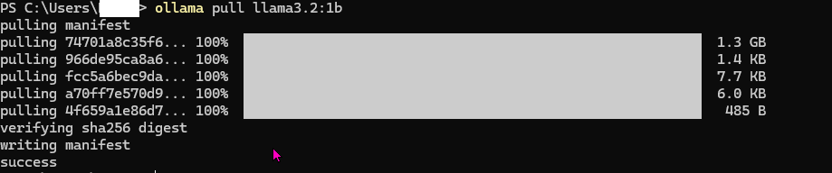

Now you are ready to setup your Streamlit python project  


## Clone this repository
The project is setup for VSCODE

git clone https://github.com/LazerLars/streamlit_ollama_chat_bot.git

## launch.json for debugging streamlit
The .vscode/lanch.json file lets you open a streamlit in vs code on F5 and debug your streamlit app.  
If you for some reason need to debug another regular python file for test purposes then you need to switch the debugger.  
Press Ctrl + D  
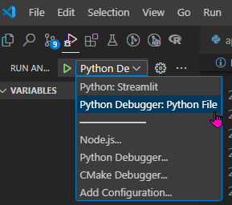  
Remember to switch back the same way to streamlit if you want to debug in the streamlit app again.

## Create virtual envoriment
```bash
python -m venv .venv
```
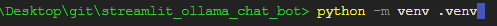

## activate .venv
```bash
.\.venv\Scripts\activate
```
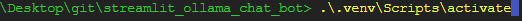  
  
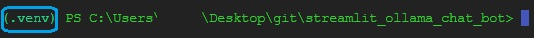

## install requirements.txt
You need to install the requirements or the just the streamlit and ollama package to run the app.

```bash
pip install requirements.txt

```
Or you can just download the packages needed yourself
```bash
pip install ollama
pip install streamlit
```
[Ollama documentation](https://github.com/ollama/ollama-python)  
[Streamlit documentation](https://docs.streamlit.io/develop/api-reference)

## Now you are ready to launch the app
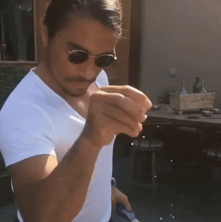  
Now open the app.py file  
Press F5 or write in your terminal 
```bash
streamlit run .\app.py
```
Please be aware that if you run with the terminal command then you are not able to debug.
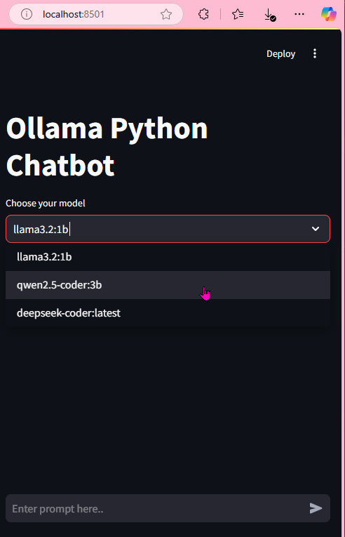  
Here you see I installed 3 LLM models on my machine, now you can choose the model and ask it a questios.  

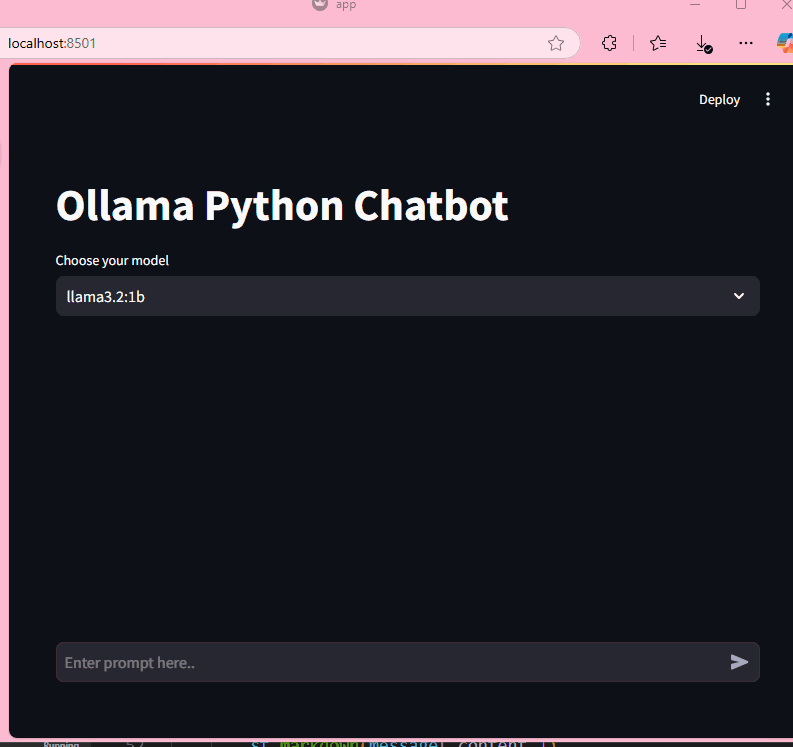

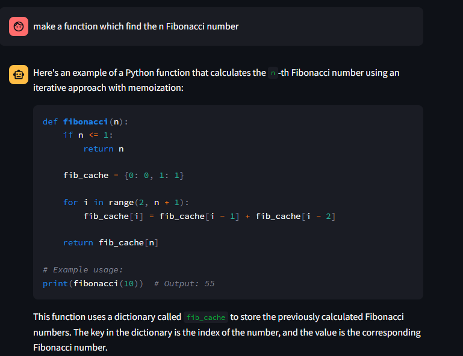

This project was only possible due to the good work of https://github.com/romilandc/streamlit-ollama-llm which this is really heavily a modifed fork of.
The complexity have been reduced a little bit with removing the Torch package, where you can choose weather to use GPU or CPU. Also comments have been added for the code, which I find many new comers to running your first LLM model locally will benefit from. 

This have all been run on a ThinkPad T14 Gen3. Depending on your computer some of the responses may be quicker/slower than otheres.  

As far a my knowledge reach, then using Ollama means you can run the models totally locally without having the risk of your data beeing send to third parties. Thanks to Ollama for making this possible :) 
